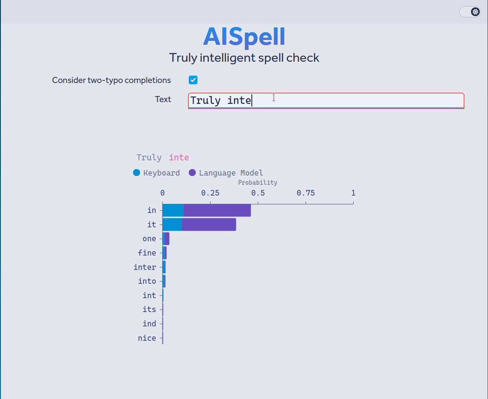

# AISpell
## Truly intelligent spell checking

When you make a typo, two things happened:
 - You meant to type one word.
 - You typed something else instead.

AISpell models both of these steps in order to provide more accurate spelling correction. When it looks at a word, it considers all of the possible words that are one or two typos away from what was actually typed.

Then, for each of those potential corrections:
 
 - The probability of accidentally typing the observed text instead of the potential correction is calculated using a model that considers the QWERTY keyboard layout.
 - Then, a language model (not unlike the one used in ChatGPT, although much smaller so it can run more quickly) computes the probability that the correction was what the typist meant.

These probabilities are multiplied for each potential completion, resulting in a distribution over potential completions that can be used for correction or alerting the user.

Prior approaches tend to only consider one source of information.  Purely neural-network-based spellcheck tools don't consider how unlikely certain mistakes would actually be:

On the other hand, traditional spellcheck doesn't consider the context of what you're typing. If someone types "I don't know why I went **ther**", we know they probably meant to type "there" and not "their" or "ether".

 

AISpell is still in development. The target use case is realtime spell-checking, although the underlying approach should work equally well in batched contexts (i.e., checking a document.)

Directions for further development:

 - Modern language models are large, and using them in a real-time environment on consumer hardware requires significant optimization. More work can be done in this area.
 - Tweaking the correction part of the API (when to auto-correct) needs to be done, perhaps with a dataset.
 - Dealing with punctuation and word-boundary errors needs to be better.
 - Theoretically, both the language and keyboard models could be fine-tuned to specific people. A user interface and infrastructure to do this would be a killer feature.
 - A drop-in replacement for hunspell or similar CLI tools that would allow AISpell to be used in that context would be great.